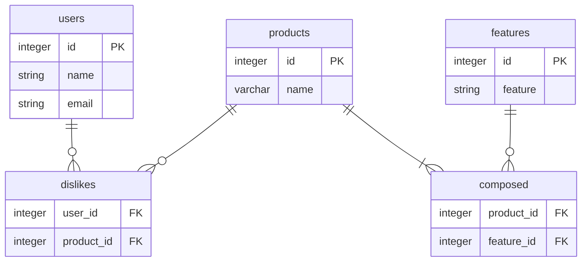

# ユーザーの好みに合わせて商品を表示するアプリケーション

# todo
- [x] 【productモデル】
  - [x] モデルを作る(モデルのバリデーションテスト付き)
  - [x] コントローラーを作る
  - [x] viewを作る(ユーザー一覧を参考にeach doからブラッシュアップ)
  - [x] seedsを作る
  - [x] fixtureを作る
  - [x] 商品画像を準備して保存する
  - [x] testを作る(ログイン後に限りhomeページに商品一覧が表示されているか)
  - [x] ログイン後のhomeで商品一覧を1ページデータ数指定でページネーションする
  - [x] ログイン後のhomeでタイル型に商品を並べて表示する
- [x] 【dislikesモデル】
  - [x] モデルを作る(モデルのバリデーション付き)
  - [x] dislikeボタンにAjaxを適用する
  <!-- - [ ] dislike_productsを除いた商品一覧のページ -->
  - [x] ログイン後のhomeにテストを表示
  - [x] テスト商品にdislikeボタンを付けて、ボタンを押すと該当商品をdislikesテーブルに保存
  - [x] ボタン押印でdislike保存のテストを作る(integration)
  - [x] seedsにdislikes関係を入れる
  - [x] fixtureにdislikes関係を入れる
  


## アプリケーション名
「Original App」

## アプリケーション概要
アカウントを作成したユーザーに対し、テストを通してユーザーの服の好みを判断し、ユーザーの好みに合わせて商品を表示するアプリケーションです。

## はじめに
これは、次の教材で作られたサンプルアプリケーションを基に作成したアプリケーションです。
[*Ruby on Rails チュートリアル*](https://railstutorial.jp/)
（第6版）
[Michael Hartl](https://www.michaelhartl.com/) 著

## ライセンス

このソフトウェアは、MITライセンスのもとで公開されています。LICENSE.txtをご確認ください。
また、このソフトウェアで使用されている[Ruby on Rails チュートリアル](https://railstutorial.jp/)内にあるソースコードはMITライセンスとBeerwareライセンスのもとで公開されています。
詳細は [LICENSE.md](LICENSE.md) をご覧ください。


## 使い方

このアプリケーションを動かす場合は、まずはリポジトリを手元にクローンしてください。
その後、次のコマンドで必要になる RubyGems をインストールします。

```
$ gem install bundler -v 2.2.17
$ bundle _2.2.17_ config set --local without 'production'
$ bundle _2.2.17_ install
```

その後、データベースへのマイグレーションを実行します。

```
$ rails db:migrate
```

最後に、テストを実行してうまく動いているかどうか確認してください。

```
$ rails test
```

テストが無事に通ったら、Railsサーバーを立ち上げる準備が整っているはずです。

```
$ rails server
```

詳しくは、[*Ruby on Rails チュートリアル*](https://railstutorial.jp/)
を参考にしてください。


## コミットルール
コミットメッセージに次の接頭辞を加えています。
* **feat**: A new feature
* **fix**: A bug fix
* **docs**: Documentation only changes
* **style**: Changes that do not affect the meaning of the code (white-space, formatting, missing
  semi-colons, etc)
* **refactor**: A code change that neither fixes a bug nor adds a feature
* **perf**: A code change that improves performance
* **test**: Adding missing or correcting existing tests
* **chore**: Changes to the build process or auxiliary tools and libraries such as documentation
  generation


# 要件定義

## モック図
ユーザーの初回ログイン時のHome画面は以下の通りです。

画面右のボタンを押すと、テストが始まります。テスト画面は以下の通りです。

画面右下のボタンを押してテストを進め、テストが完了すると以下の画面が表示され、ユーザーの好む要素が提示されます。

画面右下のボタンを押すと、以下のようにユーザーのホーム画面に、ユーザーの好む要素に基づいたおすすめ商品が表示されます。

## ER図

このアプリケーションのER図は以下の通りです。

## 使用しているデータテーブル

### usersテーブル
ユーザーのid、名前、e-mailアドレス等を保持しているテーブルです。
### productsテーブル
商品のidと名前を保持しているテーブルです。
### featuresテーブル
服の特徴(例：ラウンドネック)とそのidを保持しているテーブルです。
### dislikesテーブル
ユーザーのidと商品のidを保持しているテーブルです。ユーザーがテストでDislikeを選択した商品のidが保存されます。
### composedテーブル
商品のidと特徴のidを保持しているテーブルです。その商品がどの特徴を持っているのかが保存されています。


# メソッド
## dislikesテーブル
 |  メソッド  |  用途  |
 | ---- | ---- |
 |  dislike.user  |  Dislikeに紐づいたUserオブジェクトを返す  |
 |  user.dislikes  |  UserのDislikeの集合を返す  |
 |  user.dislikes.create(arg)  |  userに紐づいたdislikeを作成する  |
 |  user.dislikes.create!(arg)  |  userに紐づいたdislikeを作成する(失敗時に例外を発生)  |
 |  user.dislikes.build(arg)  |  userに紐づいた新しいdislikeオブジェクトを返す  |
 |  user.dislikes.find_by(id: 1)  |  userに紐づいて、idが１であるdislikeを検索する  |
 


## ユーザー、dislike、productモデルの関連付けによって使えるようになったメソッドのまとめ
 |  メソッド  |  用途  |
 | ---- | ---- |
 |  dislike.user  |  Dislikeに関連づいたユーザーを返す  |
 |  dislike.product  |  Dislikeに関連づいた商品を返す  |
 |  user.dislikes.create(product_id: 1)  |  userと紐付けてid1の商品とdislike関係を作成/登録する  |
 |  user.dislikes.create!(product_id: 1)  |  userと紐付けてid1の商品とdislike関係を作成/登録する(失敗時にエラーを出力)  |
 |  user.dislikes.build(product_id: 1)  |  userと紐付けた、id1の商品との新しいDislikeオブジェクトを返す  |
 


# RESTfulなルート
## Productsリソース
|  HTTPリクエスト  |  URL  |  アクション  |  名前付きルート  |  用途  |
|  ----  |  ----  |  ----  |  ----  |  ----  |
|  GET  |  /products/1  |  show  |  product_path(product)  |  特定の商品を表示するページ  |

## Featureリソース
|  HTTPリクエスト  |  URL  |  アクション  |  名前付きルート  |  用途  |
|  ----  |  ----  |  ----  |  ----  |  ----  |
|    |    |    |    |    |

## Dislikesリソース
|  HTTPリクエスト  |  URL  |  アクション  |  名前付きルート  |  用途  |
|  ----  |  ----  |  ----  |  ----  |  ----  |
|  POST  |  /dislikes  |  create  |  dislikes_path  |  dislike関係を作成する  |
|  DELETE  |  /dislikes/1  |  destroy  |  dislike_path(dislike)  |  dislikesテーブルのidが１のdislike関係を削除する  |

<!-- 
## カスタムルール(routeでresouces :users do)で提供するルート
|  HTTPリクエスト  |  URL  |  アクション  |  名前付きルート  |  用途  |
|  ----  |  ----  |  ----  |  ----  |  ----  |
|  GET  |  /users/1/dislike_products  |  dislike_product  |  dislike_products_user_path(1)  |    | -->
