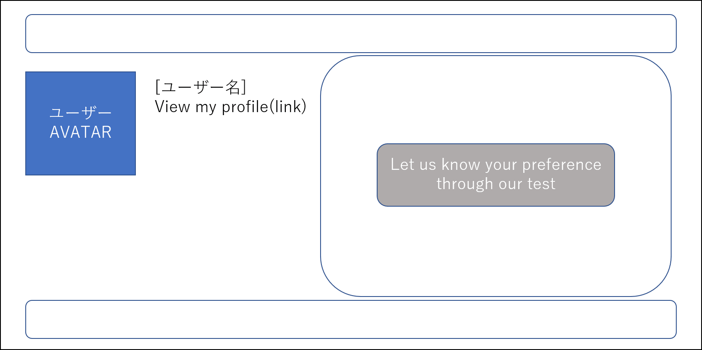
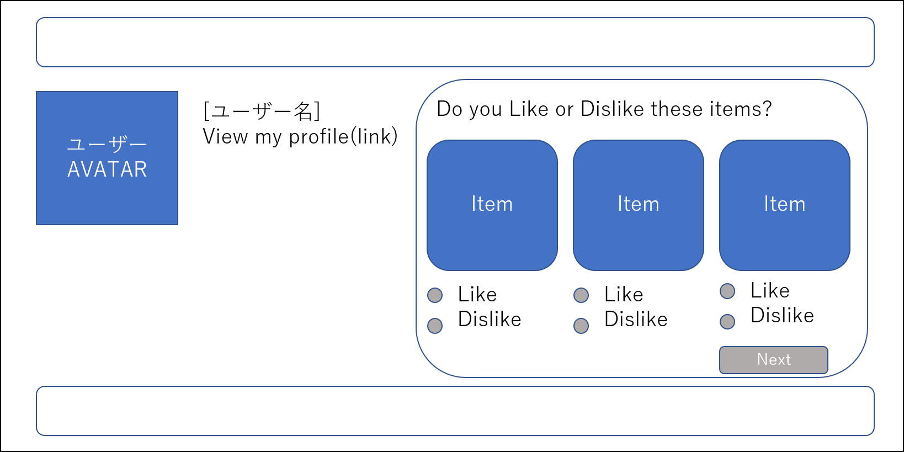
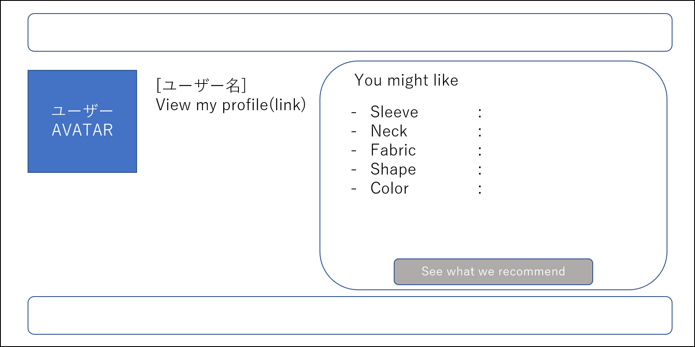
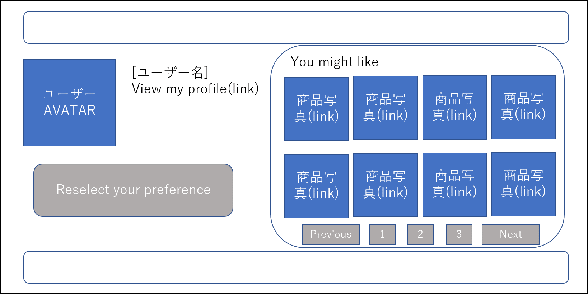
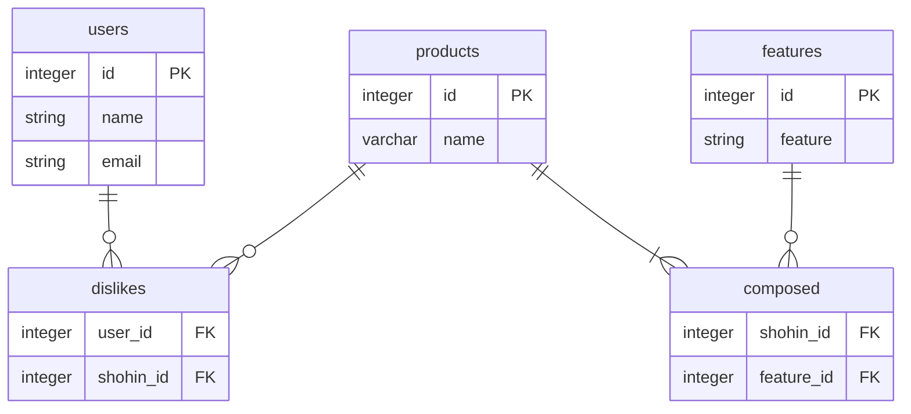

# ユーザーの好みに合わせて商品を表示するアプリケーション

## アプリケーション名
「Original App」

## アプリケーション概要
アカウントを作成したユーザーに対し、テストを通してユーザーの服の好みを判断し、ユーザーの好みに合わせて商品を表示するアプリケーションです。

## はじめに
これは、次の教材で作られたサンプルアプリケーションを基に作成したアプリケーションです。
[*Ruby on Rails チュートリアル*](https://railstutorial.jp/)
（第6版）
[Michael Hartl](https://www.michaelhartl.com/) 著

## ライセンス

このソフトウェアは、MITライセンスのもとで公開されています。LICENSE.txtをご確認ください。
また、このソフトウェアで使用されている[Ruby on Rails チュートリアル](https://railstutorial.jp/)内にあるソースコードはMITライセンスとBeerwareライセンスのもとで公開されています。
詳細は [LICENSE.md](LICENSE.md) をご覧ください。


## 使い方

このアプリケーションを動かす場合は、まずはリポジトリを手元にクローンしてください。
その後、次のコマンドで必要になる RubyGems をインストールします。

```
$ gem install bundler -v 2.2.17
$ bundle _2.2.17_ config set --local without 'production'
$ bundle _2.2.17_ install
```

その後、データベースへのマイグレーションを実行します。

```
$ rails db:migrate
```

最後に、テストを実行してうまく動いているかどうか確認してください。

```
$ rails test
```

テストが無事に通ったら、Railsサーバーを立ち上げる準備が整っているはずです。

```
$ rails server
```

詳しくは、[*Ruby on Rails チュートリアル*](https://railstutorial.jp/)
を参考にしてください。


## コミットルール
コミットメッセージに次の接頭辞を加えています。
* **feat**: A new feature
* **fix**: A bug fix
* **docs**: Documentation only changes
* **style**: Changes that do not affect the meaning of the code (white-space, formatting, missing
  semi-colons, etc)
* **refactor**: A code change that neither fixes a bug nor adds a feature
* **perf**: A code change that improves performance
* **test**: Adding missing or correcting existing tests
* **chore**: Changes to the build process or auxiliary tools and libraries such as documentation
  generation


# 要件定義

## モック図
ユーザーの初回ログイン時のHome画面は以下の通りです。

画面右のボタンを押すと、テストが始まります。テスト画面は以下の通りです。

画面右下のボタンを押してテストを進め、テストが完了すると以下の画面が表示され、ユーザーの好む要素が提示されます。

画面右下のボタンを押すと、以下のようにユーザーのホーム画面に、ユーザーの好む要素に基づいたおすすめ商品が表示されます。

## ER図

このアプリケーションのER図は以下の通りです。

## 使用しているデータテーブル

### usersテーブル
ユーザーのid、名前、e-mailアドレス等を保持しているテーブルです。
### productsテーブル
商品のidと名前を保持しているテーブルです。
### featuresテーブル
服の特徴(例：ラウンドネック)とそのidを保持しているテーブルです。
### dislikesテーブル
ユーザーのidと商品のidを保持しているテーブルです。ユーザーがテストでDislikeを選択した商品のidが保存されます。
### composedテーブル
商品のidと特徴のidを保持しているテーブルです。その商品がどの特徴を持っているのかが保存されています。

  
